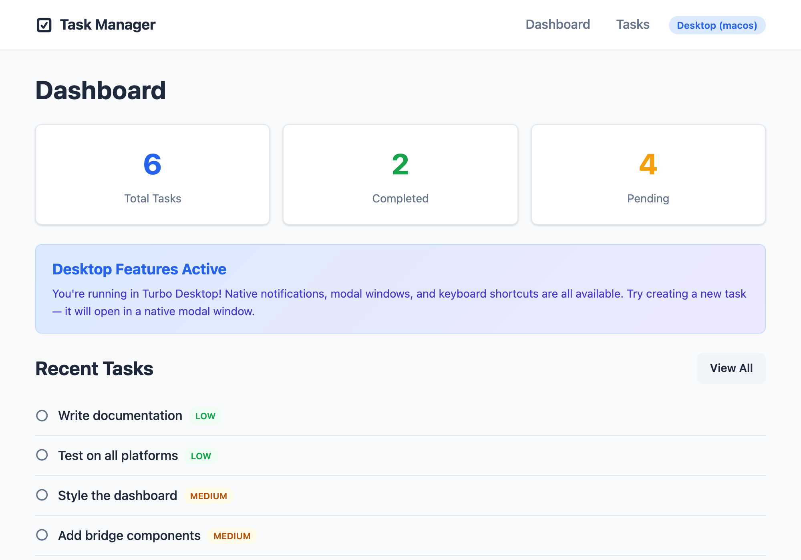

<p align="center">
  
</p>

<h1 align="center">Turbo Desktop</h1>

<p align="center">
  <strong>Turbo Native for Desktop</strong> — wrap your Rails app in a native macOS / Windows / Linux shell
</p>

<p align="center">
  <a href="#features">Features</a> •
  <a href="#architecture">Architecture</a> •
  <a href="#quick-start">Quick Start</a> •
  <a href="#path-configuration">Path Config</a> •
  <a href="#bridge-components">Bridge</a> •
  <a href="#rails-gem">Rails Gem</a> •
  <a href="#comparison">Comparison</a> •
  <a href="https://aguspe.github.io/turbo_desktop/">Docs</a>
</p>

<p align="center">
  
  
  
  
  
</p>

---

## The Problem

Rails developers already have **Hotwire Native** (`turbo-ios` and `turbo-android`) to wrap their web apps in native mobile shells. But there has been *nothing* for desktop.

**Turbo Desktop** fills this gap. It gives you a thin, native desktop shell powered by [Tauri 2](https://tauri.app) that treats your Rails app as the single source of truth — the same pattern you already know from Hotwire Native, but for the desktop.

## Example App

Here's what a Rails app looks like running inside Turbo Desktop (from the [example Task Manager app](https://github.com/aguspe/turbo_desktop_example_app)):

<p align="center">
  
</p>

## Features

- **No new UI framework** — your existing Rails views, Turbo Frames, and Stimulus controllers just work
- **Native when you need it** — notifications, file pickers, menus, and keyboard shortcuts via Bridge Components
- **Tiny binary** — Tauri uses the OS WebView, no bundled Chromium. Ship a ~5-10 MB app
- **Path configuration** — JSON-based routing rules (same concept as turbo-ios / turbo-android)
- **Bridge components** — web-to-native communication via Stimulus controllers
- **Rails gem** — `turbo_desktop-rails` gives your Rails app desktop shell awareness
- **CLI scaffolding** — `npx turbo-desktop new myapp` to get started fast

## Architecture

```
┌──────────────┐     ┌──────────────┐     ┌──────────────────┐
│ Rails Server │ ──▶ │   WebView    │ ──▶ │  Tauri / Rust    │
│ HTML + Turbo │     │ turbo-       │     │  Windows, menus, │
│   Drive      │     │ desktop.js   │     │  OS APIs         │
└──────────────┘     └──────────────┘     └──────────────────┘
```

Three layers that mirror the Hotwire Native pattern:

1. **Rails Server** — your existing app serves HTML with Turbo Drive
2. **WebView** — `turbo-desktop.js` intercepts Turbo visits and bridges to native
3. **Tauri Shell** — Rust handles window management, path config routing, and OS APIs

## Quick Start

### 1. Clone and install dependencies

```bash
git clone https://github.com/aguspe/turbo_desktop.git
cd turbo_desktop
cargo install tauri-cli
npm install
```

### 2. Configure your Rails server URL

Edit `turbo-desktop.config.json`:

```json
{
  "server_url": "http://localhost:3000",
  "app_name": "My App",
  "path_configuration_url": "http://localhost:3000/turbo-desktop/path-configuration.json"
}
```

> `path_configuration_url` is optional — it defaults to
> `{server_url}/turbo-desktop/path-configuration.json`.

### 3. Add the Rails gem

```ruby
# Gemfile
gem "turbo_desktop-rails"
```

```bash
bundle install
rails generate turbo_desktop:install
```

### 4. Serve path configuration from Rails

```ruby
# config/routes.rb
get "/turbo-desktop/path-configuration", to: "turbo_desktop#path_configuration"
```

### 5. Run the desktop app

```bash
# Start your Rails server
bin/rails server

# Start the Tauri desktop app
cargo tauri dev
```

## Path Configuration

The path configuration is a JSON file that maps URL patterns to presentation rules — the same concept from turbo-ios and turbo-android.

```json
{
  "settings": {
    "screenshots_enabled": true,
    "pull_to_refresh_enabled": false
  },
  "rules": [
    {
      "patterns": ["/"],
      "properties": { "presentation": "default" }
    },
    {
      "patterns": ["/new$", "/edit$"],
      "properties": { "presentation": "modal", "title": "Edit" }
    },
    {
      "patterns": ["/reports/"],
      "properties": { "presentation": "new_window" }
    },
    {
      "patterns": ["/settings"],
      "properties": { "presentation": "native" }
    }
  ]
}
```

| Presentation | Behavior |
|---|---|
| `default` | Navigate in the current window (Turbo Drive handles it) |
| `modal` | Open the URL in a modal-style window (800×600) |
| `new_window` | Open the URL in a full separate window (1200×800) |
| `replace` | Replace the current page with no back-navigation |
| `native` | Emit a `native-screen-requested` event for Rust UI |
| `none` | Do nothing — handled entirely by a Bridge Component |

## Bridge Components

The Bridge is the desktop equivalent of **Strada**. It lets your web components talk to native OS features through structured message passing.

### Built-in Components

| Component | Description |
|---|---|
| `notification` | Show native OS notifications |
| `menu-item` | Register items in the native menu bar |
| `file-picker` | Open native file-open/save dialogs |
| `badge` | Set the dock/taskbar badge count |
| `shortcut` | Register global keyboard shortcuts |

### Dev Inspector

In development, press **Cmd/Ctrl+Shift+D** to open the Dev Inspector — an in-app
overlay that shows:

- **Components** — every available bridge component, with a copy-pasteable
  Rails + Stimulus snippet, and which are active on the current page
- **Messages** — a live log of web↔native bridge traffic
- **Navigation** — the path-configuration presentation applied to the current URL
- **Shell** — platform, arch, version, and server URL

Enable it from the Rails gem (added by the installer in development):

```ruby
# config/initializers/turbo_desktop.rb
config.inspector_enabled = Rails.env.development?
```

```erb
<%# app/views/layouts/application.html.erb, in <head> %>
<%= turbo_desktop_inspector_meta_tag %>
```

Or flip it on against any build without a rebuild:
`localStorage.setItem("td:inspector", "1")`.

### JavaScript Example

```javascript
import { Controller } from "@hotwired/stimulus"

export default class extends TurboDesktop.stimulusBridge(Controller, "notification") {
  connect() {
    super.connect()
    this.sendBridge("connect", { title: "My App" })
  }

  notify(event) {
    this.sendBridge("connect", {
      title: "New Message",
      body: event.target.dataset.body
    })
  }

  receiveBridge(message) {
    console.log("Native says:", message)
  }
}
```

### Rails View Helpers

```erb
<%# Attach bridge data attributes to any element %>
<%= tag.button "Export PDF",
    **turbo_desktop_bridge("menu-item",
      title: "Export PDF",
      shortcut: "Cmd+E"
    ) %>
```

## Rails Gem

The `turbo_desktop-rails` gem gives your Rails app awareness of the desktop shell.

| Helper | Description |
|---|---|
| `turbo_desktop_app?` | Returns `true` if request comes from Turbo Desktop |
| `turbo_desktop_platform` | Returns `"macos"`, `"windows"`, `"linux"`, or `nil` |
| `turbo_desktop_arch` | Returns `"aarch64"`, `"x86_64"`, or `nil` |
| `turbo_desktop_only { }` | Renders block only inside the desktop app |
| `turbo_web_only { }` | Renders block only for web (non-desktop) users |
| `turbo_desktop_bridge(component, **opts)` | Outputs bridge data attributes |

## Comparison

| Concept | turbo-ios | turbo-android | Turbo Desktop |
|---|---|---|---|
| Shell runtime | WKWebView (Swift) | WebView (Kotlin) | Tauri WebView (Rust) |
| Path configuration | JSON, last-match-wins | JSON, last-match-wins | JSON, last-match-wins |
| Bridge / native comms | Strada | Strada | BridgeComponent |
| JS injection | WKUserScript | evaluateJavascript | on_page_load + eval |
| Rails gem | turbo-rails | turbo-rails | turbo_desktop-rails |
| Binary size | System WebKit | ~20 MB | ~5-10 MB |
| Platforms | iOS, iPadOS | Android | macOS, Windows, Linux |

## Project Structure

```
turbo_desktop/
├── src/                    # JavaScript (turbo-desktop.js)
├── src-tauri/              # Rust / Tauri shell
│   └── src/
│       ├── main.rs         # App entry point
│       ├── navigation.rs   # Visit proposals & path config routing
│       ├── bridge.rs       # Bridge component handlers
│       └── window.rs       # Window management
├── turbo_desktop-rails/    # Rails gem
├── cli/                    # CLI scaffolding tool
├── templates/              # Project templates
├── test/                   # Tests
└── docs/                   # Documentation
```

## License

MIT — see [LICENSE](LICENSE) for details.

---

<p align="center">
  Built with <a href="https://tauri.app">Tauri</a>, <a href="https://hotwired.dev">Hotwire</a>, and <a href="https://rubyonrails.org">Ruby on Rails</a>.
</p>
